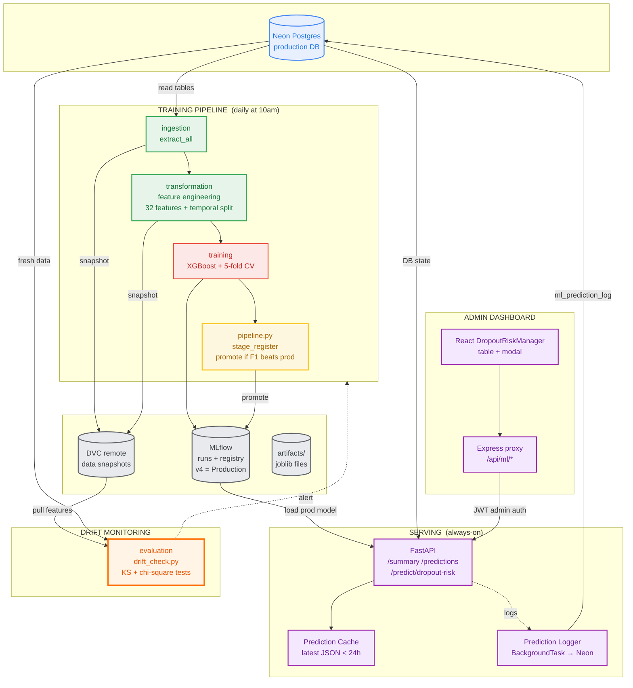
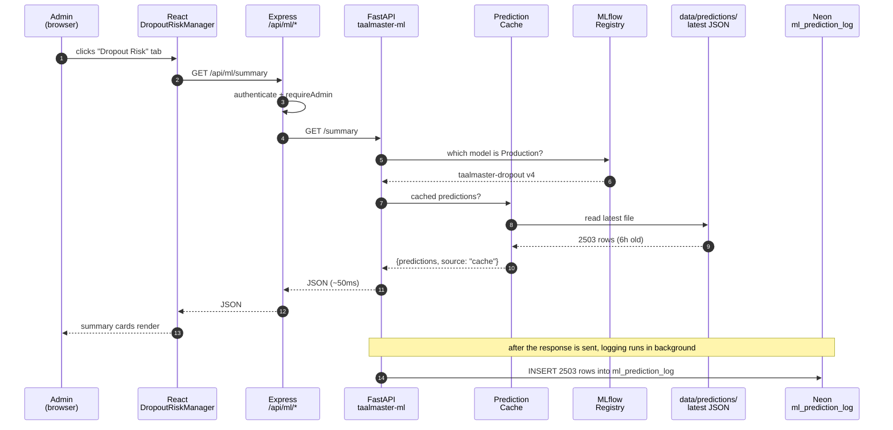
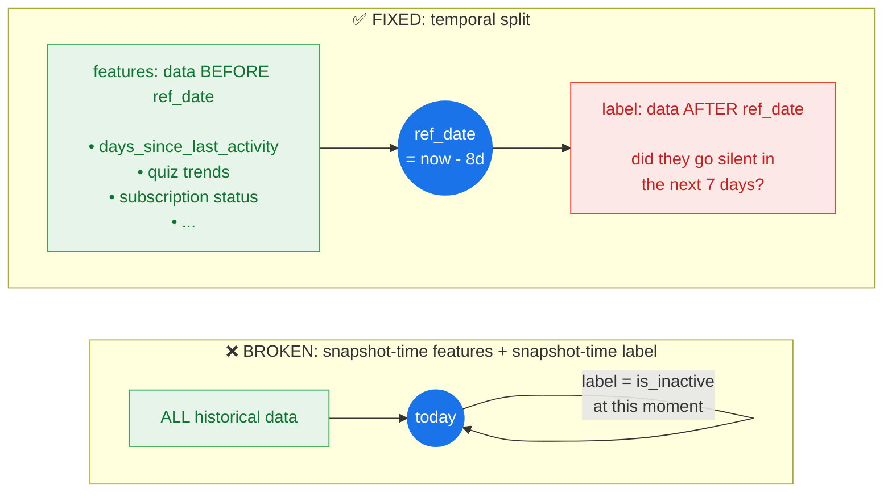
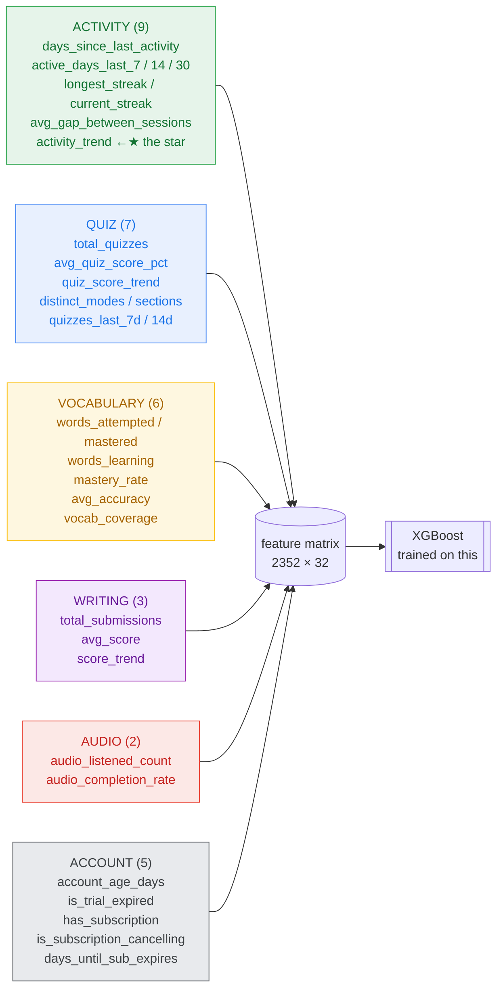
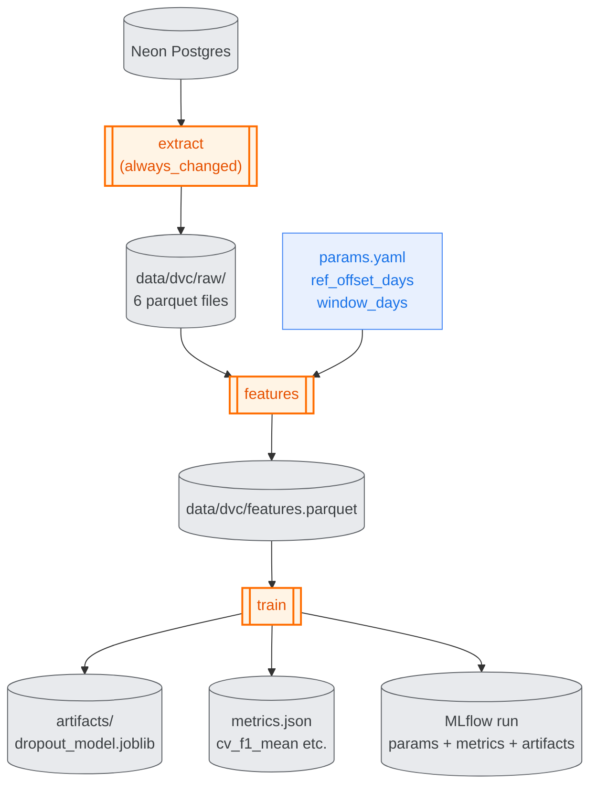
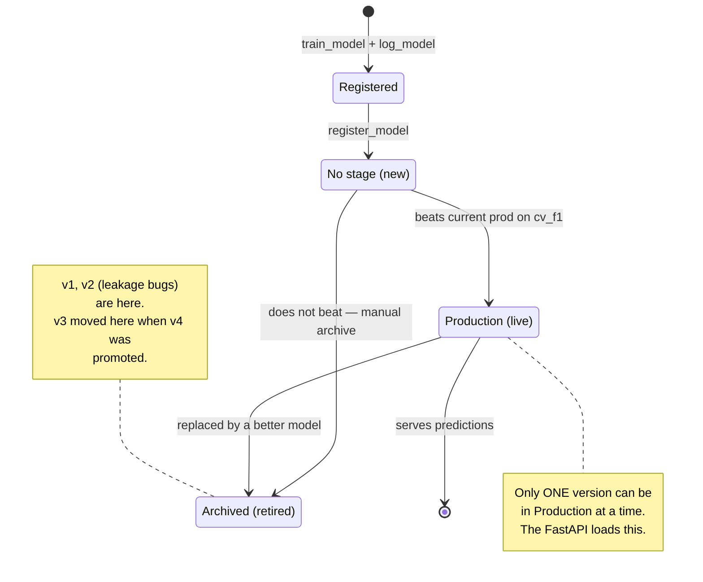
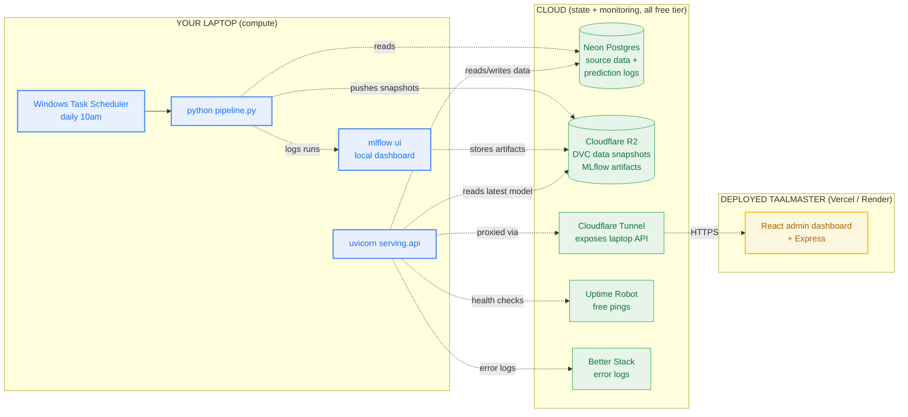
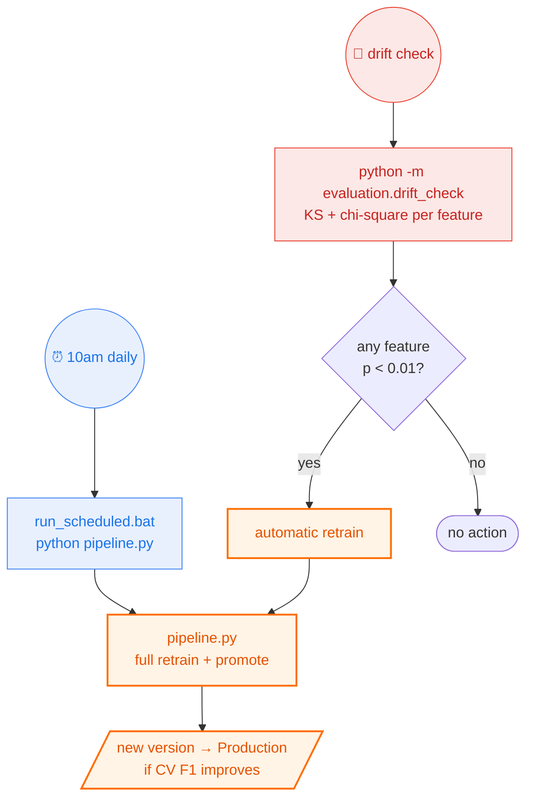

# TaalMaster ML — Visual Walkthrough

A guided tour of the system, told through diagrams. Open this file in
VSCode's Markdown Preview (Ctrl+Shift+V) or push to GitHub — the Mermaid
diagrams render automatically.

---

## 1. The big picture — one glance, whole system

This is every moving part of the repo at once. Follow the arrows clockwise
from the top-left.



### What's happening

- **Left column** — the data enters from Neon.
- **Middle-top** — every morning at 10am, the pipeline retrains and
  potentially promotes a new Production model.
- **Middle-bottom** — MLflow, DVC, and local `artifacts/` make up the
  *state* that survives between runs.
- **Right column** — the FastAPI serves predictions to the admin
  dashboard. Every prediction is logged back into Neon so we can measure
  real-world accuracy.
- **Below-right** — the drift monitor compares today's feature
  distributions to the last training snapshot, and can trigger a retrain
  if the world has changed enough.

**Key insight**: the pipeline and the API are **decoupled**. The pipeline
produces new models; the API loads whichever one the registry says is
Production. You can update one without touching the other.

---

## 2. A day in the life of a prediction

What happens when an admin opens the "Dropout Risk" tab? This is the full
request path from their browser all the way back.



### What's happening

- Steps 1–3: the browser hits Express, which is same-origin, so there's
  no CORS friction. Express checks the JWT and admin role *before*
  forwarding.
- Steps 4–5: the FastAPI first asks the MLflow registry "who's
  Production?" (This only happens on the very first request; after that
  the version is cached in memory for the rest of the process.)
- Steps 6–10: the **cache layer** is the star. Instead of re-scoring
  2,500 students live (~20–30 seconds), the API reads the most recent
  JSON that `pipeline.py` wrote to disk this morning — under 50ms.
- Step 11: FastAPI returns the response, and *then* schedules the log
  writes as a background task so the user isn't waiting on them.

**The `source: "cache"` field** in the response tells the admin
dashboard that this data was served from cache (not live). If they need
fresher numbers, they can pass `?fresh=true` and pay the 30-second cost.

---

## 3. The temporal split — the single most important concept

The original version of this model scored a **perfect 1.0 F1** — which
turned out to be a bug. It was secretly just restating the rule that
defined the label. Here's how we fixed it.



### What was wrong

In the broken version, the feature `days_since_last_activity` was both
in the model's input AND in the formula for the label (`is_dropout =
days_since_last_activity >= 7`). XGBoost just learned the rule. F1 = 1.0,
useless predictions.

### The fix

Split the timeline. **Features** only see data from before `ref_date`
(the past). The **label** only comes from data after `ref_date` (the
future). The model can no longer "see the answer" — it has to predict it.

- F1 dropped from a fake 1.0 to an honest 0.9757
- Medium-risk bucket finally had students in it
- Temporal holdout test confirmed generalization

For training, `ref_date = now − 8 days` so the 7-day forward window is
entirely observed. For live scoring, `ref_date = now` and we skip label
computation entirely.

---

## 4. The 32 features, grouped

Features are what turn "rows in a database" into "patterns a model can
learn from." This is where 80% of ML value lives.



### Why these groups

- **Activity** is most predictive — a silent user is almost always a
  dropout. `activity_trend` (recent vs older ratio) catches users who
  are *fading* before they fully go silent.
- **Quiz** is second: declining scores often predict dropout before
  activity drops (frustration → quit).
- **Vocabulary & Writing** measure *investment* in the product.
- **Audio** is passive engagement — low signal but easy to produce.
- **Account** captures business-facing churn points (trial expiry,
  subscription cancellation).

---

## 5. The training pipeline (DVC DAG)

The training pipeline is declarative — `dvc.yaml` describes a DAG of
stages. Each stage has inputs, outputs, and parameters. DVC only re-runs
what's necessary.



### What's happening

- `dvc repro` walks this DAG, top to bottom.
- `extract` always re-runs (Neon is external, DVC can't hash it), but
  its *output* gets hashed. If the extracted parquet files are
  byte-identical to last time, `features` is cached — skipped.
- Changing `params.yaml` (e.g. `window_days: 7 → 14`) re-runs `features`
  and `train` but skips `extract`.
- `metrics.json` is small and tracked in git. Running `dvc metrics diff`
  shows how tonight's metrics differ from the last commit.

### The complementary ad-hoc pipeline

`pipeline.py` is the **scheduled** version of the same flow. It doesn't
use DVC — it writes timestamped snapshots to `data/raw/YYYYMMDD/` and
lets MLflow handle experiment tracking. Windows Task Scheduler runs it
daily at 10am.

Two pipelines coexist because they serve different use cases:
- `dvc repro` — iterating on features/params; compare runs via
  `dvc exp show`
- `python pipeline.py` — scheduled retraining + registry promotion

---

## 6. The model lifecycle — registry states

A new model doesn't just appear in production. It moves through states.



### What's happening

- Every training run is **registered** as a new version of the named
  model `taalmaster-dropout`.
- `pipeline.py → stage_register` compares its CV F1 to the current
  Production version's F1. Better → promote and archive the old one.
- The API only ever loads the Production version. Promoting a new
  version + restarting the API is how deployments work.
- History stays in the registry forever. `v1` (leaky) and `v4` (current)
  both live there, so you can roll back to any past version by setting
  its stage to Production.

### Current state

| Version | CV F1 | Stage | Notes |
|---|---|---|---|
| v1 | 1.0000 | Archived | ❌ Leakage bug |
| v2 | 1.0000 | Archived | ❌ Partial fix attempt |
| v3 | 0.9753 | Archived | ✅ First honest model |
| v4 | 0.9757 | **Production** | ✅ Currently serving |

---

## 7. Serving architecture (with cache + logging)

This is what happens every time a prediction request lands. Colored
paths show the fast path (cache hit) vs the slow path (live compute).

```mermaid
flowchart TB
    classDef fast fill:#e6f4ea,stroke:#34a853,stroke-width:3px,color:#137333
    classDef slow fill:#fce8e6,stroke:#ea4335,stroke-width:2px,color:#c5221f
    classDef bg fill:#fef7e0,stroke:#fbbc04,color:#a56300
    classDef data fill:#e8eaed,stroke:#5f6368,color:#3c4043

    REQ([HTTP request]):::fast
    ENDPOINT{"/summary<br/>/predictions<br/>/predict/dropout-risk"}
    FRESH{"?fresh=true<br/>in query?"}
    CACHE{"cached JSON<br/>< 24h old?"}

    READ[read<br/>data/predictions/<br/>latest_*.json]:::fast
    LIVE[live compute:<br/>extract_all<br/>+ predict_all_students]:::slow

    RESP([return<br/>source: cache &nbsp;|&nbsp; live]):::fast
    BG[["BackgroundTask<br/>(after response sent)"]]:::bg
    LOG[(Neon<br/>ml_prediction_log)]:::data

    REQ --> ENDPOINT
    ENDPOINT --> FRESH
    FRESH -->|no| CACHE
    FRESH -->|yes| LIVE
    CACHE -->|yes| READ
    CACHE -->|no| LIVE
    READ --> RESP
    LIVE --> RESP
    RESP --> BG
    BG --> LOG
```

### What's happening

- **Fast path (green)**: most requests. A daily-refreshed JSON file is
  on disk; reading and deserializing it is <50ms.
- **Slow path (red)**: either `?fresh=true` or the cache is stale. Full
  DB extract + model scoring for 2,500 students ≈ 20-30 seconds.
- **Background task (yellow)**: every response, regardless of path,
  triggers a batch INSERT into `ml_prediction_log` on Neon. This runs
  *after* the response is sent, so the user isn't waiting on it.

### Why this matters

Logging every served prediction is how you measure real-world accuracy
*later*. After 2 weeks, join the log with `study_streaks` on `user_id`
and ask: "of the students we flagged as high-risk, how many actually
went silent?" That's the only honest measure of production performance.

---

## 8. What's local vs cloud (current + recommended)

You asked about staying cheap — keep compute local, push state to cloud
storage. This is the target topology.



### What's happening

- **Laptop**: every piece of Python that uses CPU. The scheduled task,
  the training pipeline, the FastAPI, the MLflow UI — all local, zero
  cloud compute cost.
- **Cloud (free)**:
  - Neon — already yours, already free.
  - **R2** — stores DVC data and MLflow artifacts. 10GB free forever,
    no egress fees. If your laptop dies, all your data and models are
    safe on R2.
  - **Cloudflare Tunnel** — creates a secure HTTPS URL for your laptop
    API so a deployed Taalmaster admin dashboard can reach it without
    port forwarding.
  - **Uptime Robot** + **Better Stack** — free-tier monitoring/alerting.

**Total monthly cost for this topology: $0.** Even at 10× growth.

### The one non-obvious piece: Cloudflare Tunnel

Your deployed admin dashboard runs in the cloud. Your API runs on your
laptop. Without a tunnel, the cloud can't reach your laptop. Cloudflare
Tunnel solves this: it creates an encrypted connection FROM your laptop
TO Cloudflare, and Cloudflare exposes a public URL that forwards to it.

```
Admin browser → taalmaster.vercel.app (Vercel)
  → /api/ml/* → ml.yourdomain.com (Cloudflare)
    → (encrypted tunnel) → localhost:8000 (your laptop)
```

No firewall changes. No public port. Still free.

---

## 9. The retrain trigger — scheduled + drift

The architecture diagram you showed me at the start had two retrain
triggers: **Scheduled** and **Drift**. Both are built.



### What's happening

- **Scheduled path (blue)**: the simple one. Windows Task Scheduler
  fires the batch file every morning at 10am, regardless of anything.
- **Drift path (red)**: compares today's feature distributions against
  the most recent training snapshot. If enough features have shifted
  (p < 0.01 on the per-feature statistical test), trigger a retrain.
  Useful on top of scheduled runs when conditions change suddenly —
  e.g., right after a marketing campaign or a pricing change.

### How to chain them

```bash
python -m evaluation.drift_check --fail-on-drift \
    || python pipeline.py
```

Translation: "run the drift check. If drift is found (non-zero exit
code), run the full pipeline. If no drift, do nothing." This is the
smart version of scheduled retraining — retrain only when something
actually changed.

---

## 10. Where to go from here

Each diagram above maps to one or more files in the repo. To dive
deeper:

| Topic | Start here |
|---|---|
| Pipeline code | [pipeline.py](pipeline.py), [INSTRUCTIONS.md §15](INSTRUCTIONS.md) |
| Temporal split | [transformation/feature_engineering.py](transformation/feature_engineering.py), [INSTRUCTIONS.md §8](INSTRUCTIONS.md) |
| DVC stages | [dvc.yaml](dvc.yaml), [scripts/](scripts/), [INSTRUCTIONS.md §14](INSTRUCTIONS.md) |
| Training internals | [training/train.py](training/train.py) |
| Registry management | [pipeline.py](pipeline.py) → stage_register |
| API endpoints | [serving/api.py](serving/api.py) |
| Caching strategy | [serving/prediction_cache.py](serving/prediction_cache.py) |
| Prediction logging | [inference/prediction_logger.py](inference/prediction_logger.py) |
| Drift detection | [evaluation/drift_check.py](evaluation/drift_check.py) |
| Admin dashboard wiring | [server/src/routes/ml.js](../taalmaster/server/src/routes/ml.js), [client/.../DropoutRiskManager.jsx](../taalmaster/client/src/components/admin/DropoutRiskManager.jsx) |

Or just read [INSTRUCTIONS.md](INSTRUCTIONS.md) end-to-end — it's the
written version of this walkthrough, section by section.
